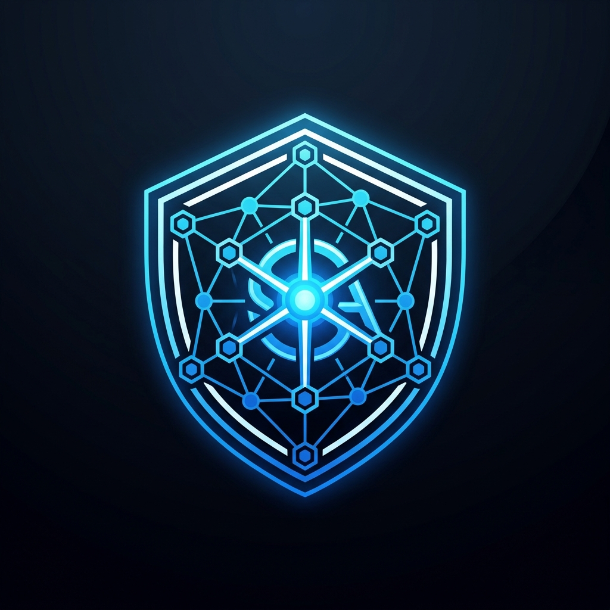
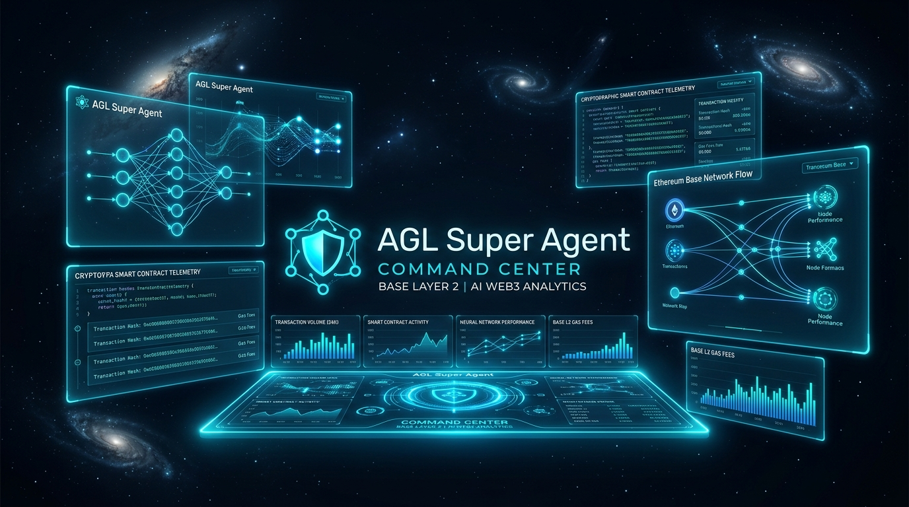
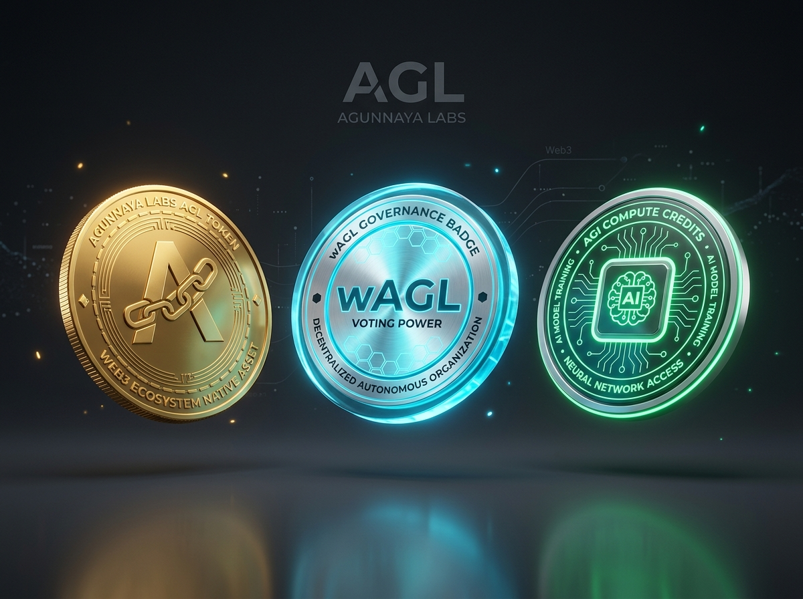

# ⚡ AGL Super Agent — AI-Powered Web3 Command Center on Base

<p align="center">
  <a href="#-agl-super-agent--ai-powered-web3-command-center-on-base">
    
  </a>
</p>

<p align="center">
  <strong>Next-Generation Autonomous AI Agent & Verifiable Web3 Intelligence Engine Built for Base Mainnet (Chain ID: 8453)</strong>
</p>

<p align="center">
  
  
  
  
  
  
  
</p>

---

## 🌟 Visual Identity & Showcase

<p align="center">
  
</p>

<p align="center">
  
</p>

---

## 📌 Executive Summary

**AGL Super Agent** is an enterprise-grade, client-side Android application that converges cutting-edge artificial intelligence (**Google Gemini**) with decentralized finance and on-chain intelligence on **Base Layer 2 (Coinbase)**.

Engineered with a **Zero-Private-Key Watch-Only Architecture**, the application guarantees maximum security while providing instant real-time telemetry, transaction explanations, smart contract audits, governance voting simulations, and interactive Web3 learning quests.

---

## 🚀 Key Modules & Capabilities

### 1. 🛡️ Live Base Mainnet Integration & RPC Failover
- **Native Web3j Android Engine**: Seamlessly communicates with Base Mainnet JSON-RPC nodes with zero latency.
- **Smart Failover Pipeline**:
  - Primary: `https://mainnet.base.org`
  - Secondary: `https://base.llamarpc.com`
  - Fallback: `https://base-rpc.publicnode.com`
- **Real-Time On-Chain Balances**:
  - **AGL Token (ERC-20)**: Primary ecosystem utility & staking asset
  - **wAGL (ERC-20 Votes Wrapper)**: Verifiable governance voting weight
  - **AGL Compute Credits**: Decentralized AI execution accounting
  - **ETH (Base L2 Gas)**: Real-time native gas monitoring

### 2. 🤖 Gemini AI Agent & Contract Intelligence
- **AI Smart Contract Auditor**: Paste bytecode, ABI snippets, or contract addresses for automated vulnerability analysis (Reentrancy, Front-Running, Fee Taxes, Owner Backdoors).
- **Transaction Natural Language Explainer**: Deconstructs complex multi-call smart contract interactions, swaps, and staking events into clear, human-readable insights.
- **DeFi & Yield Strategist**: Tailored multi-strategy yield routing and risk assessments for Base ecosystem protocols.

### 3. 💼 Advanced Wallet & Portfolio Management
- **Instant Watch-Only Connection**: Connect any public EVM address (`0x...`) without ever exposing private keys or seed phrases.
- **Quick Switch Presets**: Pre-configured verified profiles for the AGL Foundation Treasury, Super Agent Demo Holder, and Base DeFi Staker.
- **EIP-681 Payment Support**: Generate QR/URI payment requests for rapid on-chain transfers.

### 4. 🎮 Web3 Quests, Streaks & Gamified Learning
- **Interactive Quests**: Step-by-step modular lessons covering Base L2 Architecture, Optimistic Rollups, EIP-4844 Blob Gas, and ERC-20 Votes governance.
- **Local Persistence with Room**: User XP, daily streak tracking, quest completions, and leaderboards persist safely offline.

---

## 🏛️ Base Mainnet Contract Registry

| Asset / Service | Contract Address | Type | Standard |
| :--- | :--- | :--- | :--- |
| **AGL Token** | `0xEA1221B4d80A89BD8C75248Fae7c176BD1854698` | Core Utility Token | ERC-20 |
| **wAGL (Wrapped AGL)** | `0xA27C9BA04D06EcAF766EF4e074b403DAf19A3d69` | Governance Voting | ERC-20 Votes |
| **AGL AI Credits** | `0x5B38Da6a701c568545dCfcB03FcB875f56beddC4` | Compute Units | Custom Registry |
| **AGL Agent Registry** | `0x19B86b16F5F687c93C98aA638eA9697A7650C10B` | Agent Identity | ERC-721 / Metadata |

---

## 🛠️ Architecture & Tech Stack

```
com.example/
├── data/
│   ├── local/              # Room DB entities (Wallets, Quests, Streaks, Portfolio)
│   ├── model/              # Domain models (Tokens, Transactions, Chat, Quests)
│   └── remote/
│       ├── blockchain/     # Base JSON-RPC client, multi-endpoint failover, Web3j
│       └── GeminiService   # Google Gemini Generative AI REST & streaming client
├── ui/
│   ├── components/         # Glassmorphism cards, token rows, dynamic progress bars
│   ├── screens/
│   │   ├── home/           # Live overview, portfolio breakdown, quick actions
│   │   ├── wallet/         # Web3 connection modal, real-time balances, activity log
│   │   ├── ai/             # Multi-turn Gemini AI assistant & smart contract analyzer
│   │   ├── quests/         # Daily quests, curriculum modules & leaderboard
│   │   └── profile/        # Security settings, network selector, data export
│   └── theme/              # Base Cyan (#00F5FF), Base Blue (#0052FF), Dark Palette
└── MainActivity.kt         # Edge-to-edge Scaffold & Jetpack Navigation
```

### Core Libraries
- **UI & Foundation**: Jetpack Compose, Material Design 3, Navigation Compose
- **Blockchain Connectivity**: `org.web3j:core:4.9.8`, Retrofit 2, OkHttp 3 Logging Interceptor, Moshi Kotlin
- **Database & Persistence**: AndroidX Room with KSP (`room-runtime`, `room-ktx`)
- **Artificial Intelligence**: Google Gemini REST API & Firebase AI Engine
- **Image Rendering**: Coil Compose

---

## ⚙️ Building & Running

### Prerequisites
- **Android Studio Ladybug (2024.2+)** or latest
- **JDK 11 / 17**
- **Android SDK Level 36** (Min SDK 24)

### Build Steps
```bash
# Clone the repository
git clone https://github.com/your-username/agl-super-agent.git
cd agl-super-agent

# Build Debug APK
gradle assembleDebug

# Run Robolectric Unit & Integration Tests
gradle testDebugUnitTest
```

---

## 🔒 Security & Privacy Guarantees

1. **Zero Private Key Storage**: The application operates in strict read-only/watch-only mode and will never ask for, generate, or store private keys or seed phrases.
2. **Encrypted Local Storage**: Database records and active addresses are maintained on-device using SQLite Room.
3. **Transparent Auditing**: All smart contract analysis queries are routed securely via client-side API configuration without telemetry tracking.

---

<p align="center">
  <strong>Built with 💙 for the Base Ecosystem & Web3 AI Pioneers</strong>
</p>
